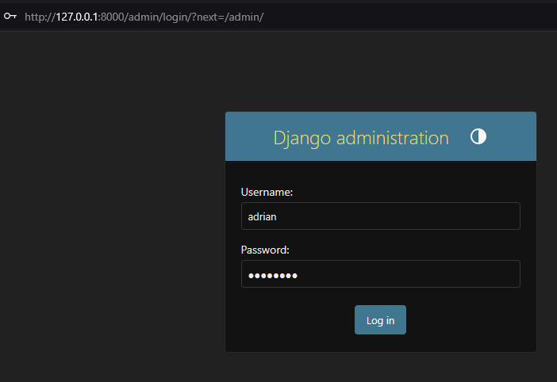
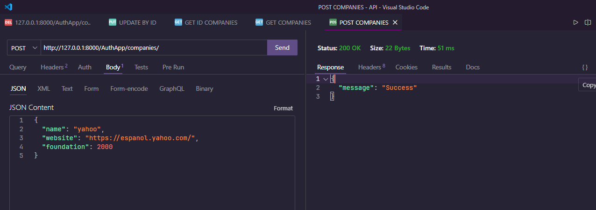
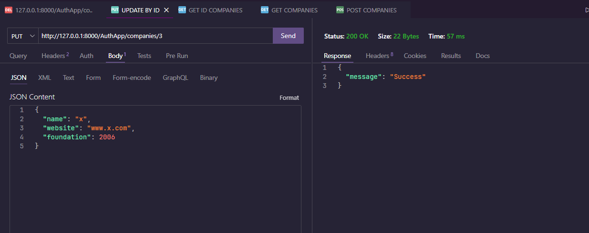
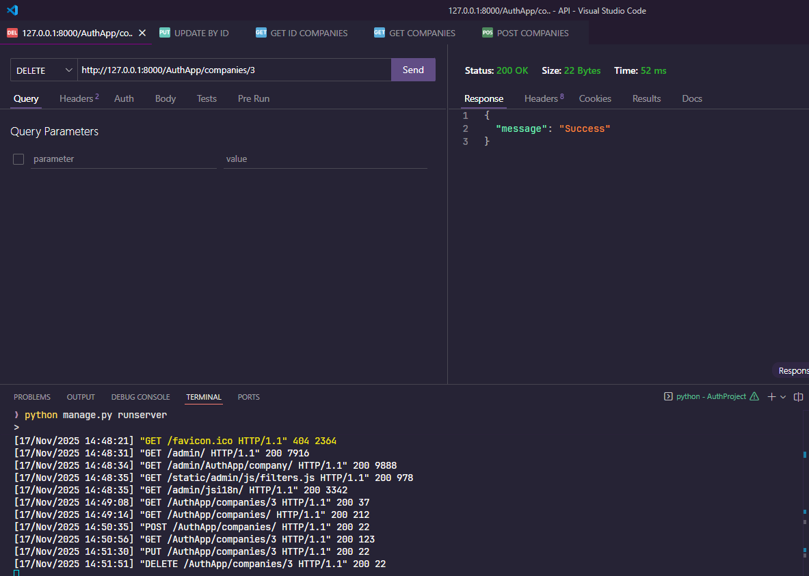

# Proyecto de API con Django + PostgreSQL

Este proyecto es una API desarrollada con Django utilizando una arquitectura modular, base de datos PostgreSQL y variables de entorno para configuración segura.

## 🖼️ Capturas de la API

A continuación se presentan capturas de las principales funcionalidades de la API:

| Imagen      | Descripción |
|-------------|-------------|
|  | **Login** – Muestra la pantalla de autenticación del usuario. |
|  | **Companies** – Vista de todas las compañías creadas en el sistema. |
|  | **GET** – Ejemplo del endpoint para obtener todas las compañías. |
|  | **GET by ID** – Consulta una compañía específica mediante su ID. |
|  | **POST** – Creación de una nueva compañía mediante una solicitud `POST`. |
|  | **PUT** – Actualización de los datos de una compañía existente. |
|  | **DELETE** – Eliminación lógica o definitiva de una compañía. |

## Requisitos

Antes de comenzar, asegúrate de tener instalado:

- Python 3.10+
- PostgreSQL
- Git
- Pip (gestión de paquetes)
- Virtualenv (opcional pero recomendado)

---

## Configuración del entorno de desarrollo

### 1️⃣ Clonar el repositorio

```bash
git clone https://github.com/<TU_USUARIO>/<TU_REPOSITORIO>.git
cd <TU_REPOSITORIO>
```

### 2️⃣ Crear y activar un entorno virtual (Windows)

```bash
python -m venv env
env\Scripts\activate
```

En Mac/Linux:

```bash
python3 -m venv env
source env/bin/activate
```

### 3️⃣ Instalar dependencias

```bash
pip install -r requirements.txt
```

---

## Variables de entorno

Crea un archivo `.env` en la raíz del proyecto con el siguiente formato:

```
SECRET_KEY=tu_clave_secreta
DEBUG=True

DB_NAME=nombre_db
DB_USER=usuario_db
DB_PASSWORD=contraseña_db
DB_HOST=127.0.0.1
DB_PORT=5432

ALLOWED_HOSTS=localhost,127.0.0.1
```

---

## Configuración de la Base de Datos

1. Crea una base de datos Postgres con el nombre especificado en `.env`.
2. Asegúrate de que tu servidor PostgreSQL esté encendido.

---

## ⚙️ Migraciones

Aplica las migraciones para preparar la base de datos:

```bash
python manage.py makemigrations
python manage.py migrate
```

---

## ▶️ Ejecutar el servidor

```bash
python manage.py runserver
```

El servidor estará disponible en `http://127.0.0.1:8000/`.

---

## 📁 Estructura del proyecto

```
.
├─ AuthApp/           # Aplicación principal
├─ AuthProject/       # Configuración del proyecto Django
├─ env/               # Entorno virtual (no se sube a Git)
├─ .env               # Variables de entorno (no se sube a Git)
├─ .gitignore         # Archivos ignorados
├─ manage.py          # CLI de Django
└─ requirements.txt   # Dependencias de Python
```


